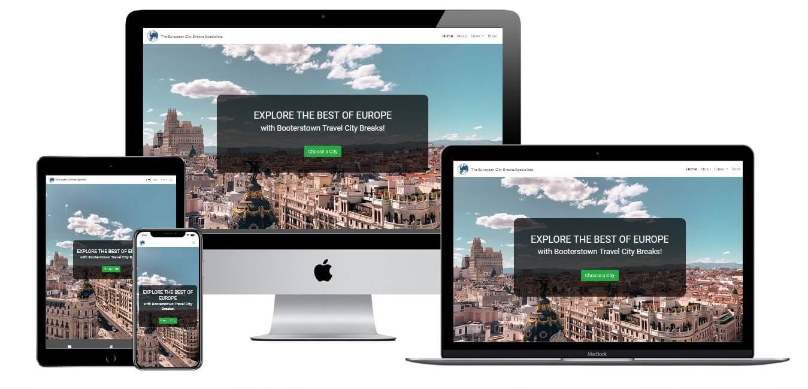
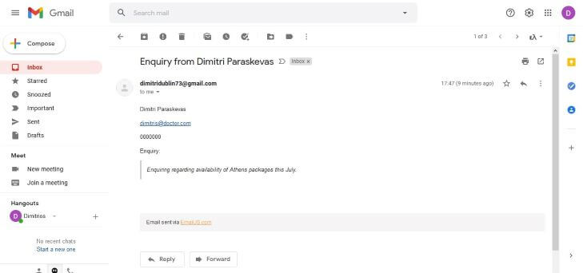
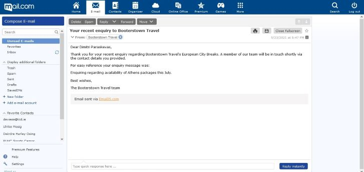
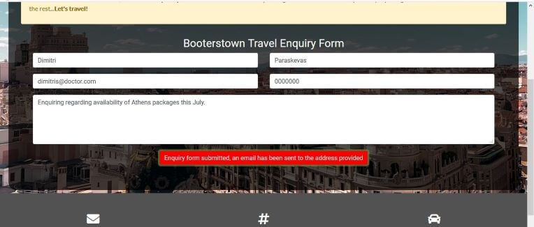
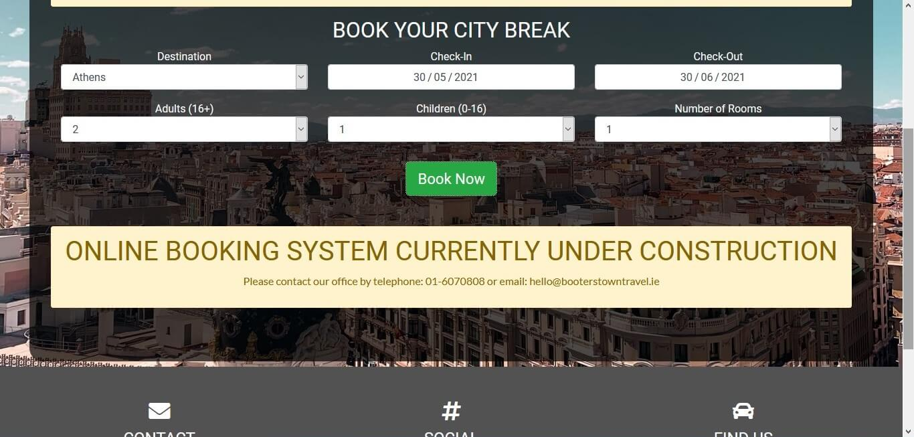
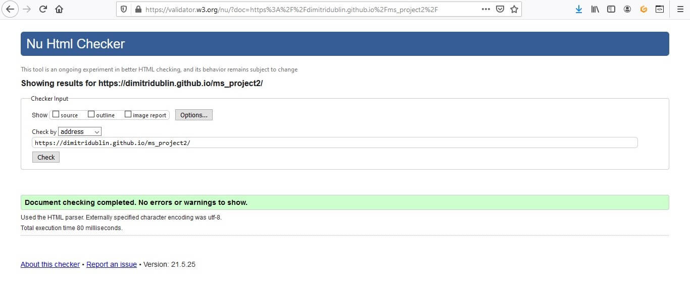
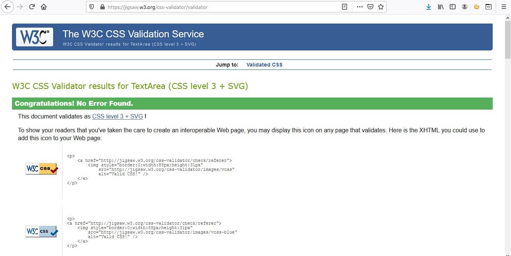

# Student: Dimitrios Paraskevas
## Project: MS Project 2 - Build an Interactive Travel Website (June 2021)

### Booterstown Travel - The European City Breaks Specialists
[View the live website here](https://dimitridublin.github.io/ms_project2/)

For my second Milestone Project I chose to build an interactive website for an imaginary travel agency, based in Booterstown, Co Dublin (i.e. project idea 1 in the 
course assessment handbook). 

#### User Stories
As a prospective client I want to find the best city break destination for my needs: read information about different cities that are potential holiday 
destinations and review city maps with relevant attractions, accommodation and restaurants clearly marked (in order to evaluate suitability of accommodation location on offer in relation to city's sights and restaurants of interest). I would also like to view photos to get an indication of each destination's beauty, major attractions, food choices and accommodation available. Easy to access links of the travel agency's social media pages would also be welcome as they can provide additional info on both the city breaks offered as well as the agency's reputation and previous customer experience through client submitted reviews. Finally, the ability to review available package options depending on users' travel requirements and the ability to select and pay for such through the website would be highly desirable too.

As the site owner I want to get users to book a city break from this site. For this purpose, I want to display information about the different cities my agency offers holiday breaks to, and allow users to get a feeling of the attractions, accommodation and restaurants each destination offers. I also want to have enticing photographs and easy enquiry and booking facilities to provide additional motivation to prospective clients to book a package directly from my website. Easy to access links of the travel agency's social media pages would also be welcome as I want to give users access to client submitted reviews for additional user reassurance. Finally, I want to highlight the excellent value and location suitability of accommodation my city break packages include, and also be able to maximise benefits of user interaction by collecting their contact details for future use (such as marketing campaigns, mailing circulars, etc.).

#### Features
##### Existing Features
* Website built with a "mobile-first" design strategy to maximise positivity of user experience.
* Care has been taken to write clean, semantic HTML throughout the process in order to allow search engines, screen readers, or other accessibility devices to access our content. This offers a positive design experience from a site owner's point of view.
* Styling reliability on Bootstrap by design means that styles are consistent, and site makes sense visually. Furthermore, it means that site is fully responsive guaranteeing that, regardless of device, users will have an equally positive experience using the website.
* Header, navigation and footer maintain their style across website to provide a smooth navigating experience for users. 
* Navigation section reduces to a hamburger menu in smaller screen sizes and company slogan appears only on bigger screen sizes. This is to ensure a "clutter-free" screen navigation experience irrespective of user's screen size. 
* Company logo on top left of each page also functions as a navigation link back to the homepage.
* Homepage is simple and stylish, inviting users to begin their city break exploration straight away.
* In the about section, users are presented with a summary of the company history along with an online enquiry form should they have additional queries. This meets both user and site owner needs as described in the User Stories section above.
* About page styling ensures that enquiry form does not take up the entire width of the page which would make it too big and result in a less positive user experience.
* Once enquiry form is filled in and submitted users get instant confirmation notification on screen of such along with further advice in relation to their query. Moreover, the functionality sends an auto-reply via Email JS to the user's email provided addressing the enquirer by name, and an email to the company's designated account with the user's details and actual query. Both actions provide a positive experience as users can instantly verify that their enquiry has been successfully submitted and will be handled by the company accordingly. In addition, they meet the site owner's needs as apart from the easy enquiry functionality itself, form collects necessary and valuable user details along the process.
* Users have two options to access the actual city information pages, either via the navigation menu leading directly to their city of choice or by clicking onto the "choose a city" button available on the homepage leading to a stylish "cities" page for users to further select their destination of choice.
* Once city of choice has been determined, users land on the respective designated city page. There, and apart from a summary about the city on top of the page, users can read more about the destination's attractions, restaurants as well as the type of accommodation available with the company's travel packages. A number of enticing photos, directly relevant to their destination of choice, further enhances the user's positive emotional response whereas the interactive Google map below (linked to the page via the Maps Javascript API) allows users to evaluate suitability of accommodation location on offer as described in the User Stories section above. In addition, the map provided offers an insight on other places of interest in and around the city of interest which further enhances the user experience.
* A link to the booking page was included in the navigation section so that users are only one click away from the booking page at all times (to the satisfaction of the site owner). 
* On top of booking page itself, and as required by the site owner, the company price promise displays prominently and unambiguously to reassure users that irrespective of the package they choose they can have peace of mind the deal they are getting is the best available on the market. In addition, and on visiting the Book page users are notified by alert message on screen of a current promotion (function scheduled to turn off automatically once promotion date passes).
* Below the company's price promise users are presented with a stylish booking menu allowing preselection of their travel requirements. This enhances user experience as at the booking stage the website will display only those holiday options suitable for them. This functionality was not further developed (i.e. on click, "book now" button hides the form and generates a message explaining that functionality is "under construction", prompting user to phone or email instead) as a) it was outside the scope of this project, and b) it required a database of actual accommodation packages which BTT as an imaginary company does not have.
* Similar to the enquiry form, book page styling ensures that the online booking facility does not take up the entire width of the page which would make it too big and result in a less positive user experience.
* Footer provides a concise guide to the establishment's opening hours, location, public transport info, social media links and contact details. As such, user experience is further enhanced as their respective requirements are easily met from any web page.

##### Features to be Implemented
* Website to support the "POST" method once user fills all sections of the enquiry form leading to submitted information being automatically stored in a purpose-built database. 
* Once user submits travel requirements on the site's book section, website to display holiday options (along with respective price) suitable for them according to city, travel period, size and consistency of travelling party, and type of accommodation required. A "select this package" button next to each suggested option to lead to a secure online payment page.
* Business could partner with other similar travel agencies in order to increase number and types of holiday packages available for sale, thus maximising potential revenue streams for site owner (as potentially travel agency will also be on a commission for each external holiday package sale achieved through its website).

#### Technologies Used
* HTML
* CSS
* Bootstrap (v.4.3.1)
* JavaScript
* jQuery v.3.3.1 (slim) (respective script code obtained through Bootstrap)
* Popper.js v.1.14.7 (script code obtained through Bootstrap)
* [Hover CSS](https://ianlunn.github.io/Hover/) to create the hovering over effects on navigation menu and social media icons
* [Awesome fonts v5.14.0](https://fontawesome.com/)
* [Google fonts](https://fonts.google.com/)
* [Logo Maker](https://logomakr.com/) was used to create the Booterstown Travel "company" logo
* Google Maps JavaScript API was used to set up the cities' maps
* [Email JS](https://www.emailjs.com/) was used to set up the emailing of site owner and auto-response functionalities when user submits an enquiry via the website
* [Multi Device Website Mockup Generator](http://techsini.com/multi-mockup/index.php) was used to create the image of website on different screen sizes on README
* [Github](https://github.com/) and [Gitpod](https://gitpod.io/) were used for website development and version storage
* [Offical W3C HTML validator](https://validator.w3.org/)
* [Jigsaw official CSS validator](https://jigsaw.w3.org/css-validator/)
* [Online JavaScript linter JSHint v.2.12.0](https://jshint.com/)
* All images were reduced in size (“tinified”) without loss of quality using [tinypng](https://tinypng.com/)
* Wireframes were created using [Balsamiq Wireframes](https://balsamiq.com/wireframes/desktop/)

#### Testing
Successfully tested user stories for compliance with their requirements as follows:
###### Users
* Prospective clients can effortlessly find information about the company's city breaks, either through the natural flow of the website ("choose a city" on homepage-> "explore" on cities page-> city of choice) or directly from the navigation menu (cities-> city name).
* On the respective city page, user can read the relevant information for each destination divided for easy reference into six distinct sections (introduction on top of page, "at a glance" info section, attractions, accommodation, restaurants, interactive map). This structure is maintained for all city pages the company offers holidays to in order to maintain user's positive experience as they browse through the website.
* A selection of photos is available on each city page and for each category of interest so that user can get an indication of each destination's beauty, major attractions, food choices and accommodation available.
* Map contains markers for all locations of interest in each city, and uses clustering to avoid a crowded appearance of such which would hinder users from distinguishing individual markers. The markers themselves can be used to evaluate suitability of accommodation location on offer in relation to city's sights and restaurants of interest as per users' requirements.
* Company's contact information, opening hours and social media links are available on the footer of each page, so that users have such at hand and at all times just by scrolling to the bottom of the page. An online enquiry form facilitates contact even further as users do not have to navigate away from the website in order to contact the agency.
* Book page offers users the option of preselecting their travel requirements in order for the website to display suitable packages that can be booked directly (latter feature to be implemented).

###### Site Owner
* As the site owner I am satisfied that users can easily find information about the different cities my agency offers holiday breaks to, using the intuitive website layout.
* I am also satisfied that content is presented in a manner that is visually appealing and user friendly, allowing users to get enough information regarding each city itself, its attractions, accommodation and restaurants.
* Location suitability of accommodation on offer in relation to each destination's main attractions and places to eat is easy to demonstrate via use of the maps provided on each city page.
* Contact and booking facilities available are easy to use ensuring that potential customers can get through all stages of their holiday search process effortlessly and without having to leave my website. Regarding the latter, I acknowledge the good practice of social media links opening onto a new tab instead of navigating user away from my website.
* Enquiry form allows for the collection of valuable user contact information such as their full name, email and telephone number.
* Links of the travel agency's social media pages are easy to access as requested.
* The price promise, highlighting the excellent value my company offers, features prominently on the book page, and is also mentioned in the about page just above the enquiry form, thus increasing prospects of potential clients continuing on with booking a holiday package directly from my website.

###### Features testing
Automation of tests was not possible on this project. Manual testing confirmed compliance with intended function of features as follows:
* Clicked on company logo on each web page and navigated directly to the homepage as expected.
* Navigation links worked as expected when clicked on each one moving user directly to the respective web page, including the dedicated pages for each city.
* Navigation links and all buttons/button type items changed appearance when hovered over as expected.
* Active navigation links were indicated by their changed appearance on navigation menu as expected.
* Clicked on the "choose a city" button on the homepage and navigated to the cities page as expected.
* On the cities page, clicked on each of the different "explore" buttons and navigated correctly to the respective city page.
* On each city page the map renders with designated markers/marker clusterers and using the specified zoom depth as required.
* On each city page map clusters correctly disperse once clicked zooming further in and revealing the cluster's individual markers.
* Restriction of Maps Javascript API key to prevent excessive and/or inappropriate use was confirmed under "credentials" on the respective Google cloud account page.
* Testing of enquiry form on about page:
  * Tried to submit the form without all fields completed and verified that an error message regarding each missing field appears
  * Tried to submit the form with an invalid email address format and verified that a relevant error message appears
  * Tried to enter non-numerical characters in the telephone number field and verified that a relevant error message appears
  * Try to submit the form with all inputs valid and verified that Email JS API works as expected by reducing allowance of free messages on my account accordingly and by:
  * correctly sending an email to the company address, including user's details and enquiry message (see screenshot below)
  * correctly sending an auto-reply to the user's provided email address, addressing enquirer by their own name (as entered in the form) and with a copy of their actual enquiry message (see screenshot below)
  * On form submission, a short and clear message on screen appeared as expected informing user that form was submitted and that an email was sent to their address provided (see screenshot below).

* When Book page loads, and as long as current date is before the end of the company's promotional period on Aug 20th, an alert window correctly appears informing user of company's additional 20% off on travel packages. When code was changed for promotion to expire on a date before current date the alert message correctly did not display on screen at page load.
* Testing of booking form on Book page:
  * Tried to submit the form without all fields completed and verified that an error message regarding each missing field appears
  * Tried to submit the form with all inputs valid and verified that on submission form itself correctly hides and function generates a message that the online booking system is under construction, prompting user to contact company by phone or email instead (as form submission function was not due to be developed during this project, see screenshot below).

* Clicked on each social media icon on each page and they opened correctly in a new tab.
* Successfully tested responsiveness for different screen sizes: desktop, tablet/iPad, large screen mobile and small screen mobile. Page elements rearrange themselves according to the current browser screen width and site maintains consistency of design and information without any elements overlapping on screen.
* Navigation menu correctly reduces to hamburger style and company slogan disappears on small screen sizes as expected.
* Website layout largely complies with original wireframe designs for different screen sizes as planned. Wireframes created for mobile as well as for desktop and tablet/iPad. See respective [wireframe images pdf](assets/docs/msp2_wireframes.pdf) (10 frames in total).
* The above tests were carried out on Firefox and Chrome browsers to also verify browser compatibility (used respective dev tools i.e. responsive design mode on Firefox and toggle device toolbar/Lighthouse on Chrome, to check the responsiveness for different screen sizes).
* Ran the Lighthouse report on Chrome, with the following results: Performance: 90, Accessibility: 92, Best practices: 87, SEO: 100. Details of Lighthouse report confirmed that any issues identified were minor and not significantly affecting overall user experience or website performance.
* HTML code was successfully validated by the the course prescribed [HTML validator](https://validator.w3.org/).
* CSS coding was validated by direct input without any errors using the course prescribed [CSS validator](https://jigsaw.w3.org/css-validator/). 
* JavaScript code passed through [jshint.com](https://jshint.com/) with no major issues.

##### Interesting bugs or problems worth reporting
* No bugs were found in the final version for submission.
* When setting up the map rendering, the callback function in the default Google script source (i.e. the "&callback=initMap" part after the API Key) did not work and map was not being rendered. As a result, and following a tutor's advice, callback was removed from the script source and calling of function initMap was coded into the separate js file connected to the Google API instead.

#### Deployment
* Logged into my github account and in the [project repository page](https://github.com/dimitridublin/ms_project2), clicked on "settings" (under the repository name) and scrolled down to "GitHub Pages"
* On the "GitHub Pages" section there was a message saying "Pages settings now has its own dedicated tab! Check it out here!". I clicked on it as required and navigated to GitHub's new dedicated pages settings tab
* On the pages settings tab and under "Source" I changed the default "none" to "master" so that my site's deployed code feeds from the my project's master branch 
* I clicked on the "Save" button and a message appeared saying "Your site is ready to be published" along with the respective link
* My site was published at https://dimitridublin.github.io/ms_project2/

#### Credits
##### Content
* Website design was inspired from https://www.crazyegg.com/blog/example-travel-websites/
* Enquiry form code adapted from template in https://bootsnipp.com/snippets/bx65A
* Booking form code adapted from template in https://bbbootstrap.com/snippets/bootstrap-bootstrap-booking-template-free-download-snippets-95433518
* Maps related JS code adapted from https://developers.google.com/maps/documentation/javascript/marker-clustering#maps_marker_clustering-javascript

##### Media
Image credits:
All photos taken from Unsplash.com. The photographs used are credited to alevision.co, Constantinos Kollias, Tania Mousinho, sun Ping chieh, Athens at a Glance, Sophie Dupau, HausPhotoMedia, reisetopia, Loes Klinker, Melissa Walker Horn, Dan Farrell, Vali Sachadonig, Diego García, Mark Lawson, Giulia Angotti, Mathew Schwartz, reisetopia, Ciudad Maderas, Subfader, Syed Ahmad, Nick Fewings, David Billings, Cristina Gottardi, Ágatha Depiné, Caleb Miller, Marco Chilese, Blake Woolwine, Christopher Ott, mark champs, engin akyurt, ABHISHEK HAJARE, Krisztina Papp (please see in-code HTML, CSS and JS comments for more details).

##### Acknowledgments
I would like to thank my mentor Akshat Garg for his useful tips and comments.

Many thanks to tutoring team for advising on coding issues when things were not working.

I would also like to thank my class peers for their encouragement on the respective Slack channels.

And of course, thanks goes to my wife and children for keeping as quiet as possible while "daddy was coding"!
